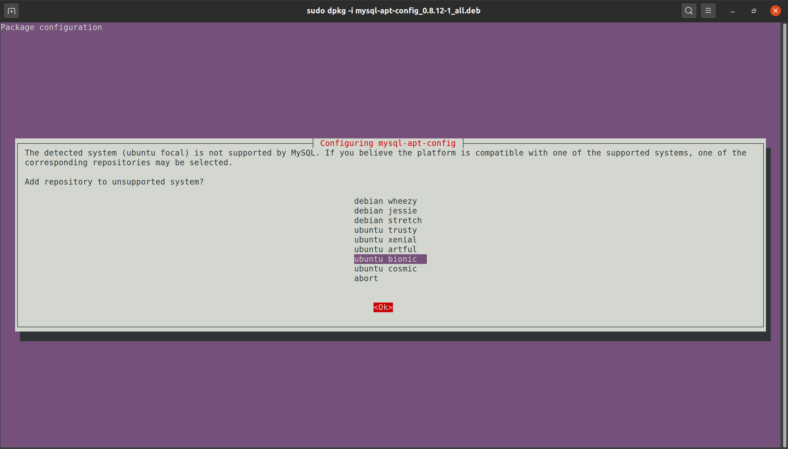
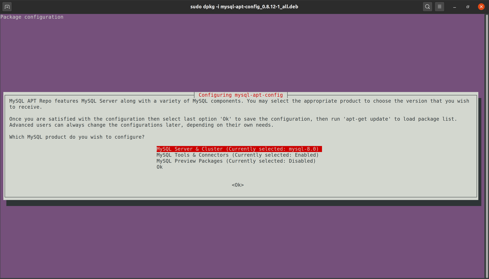
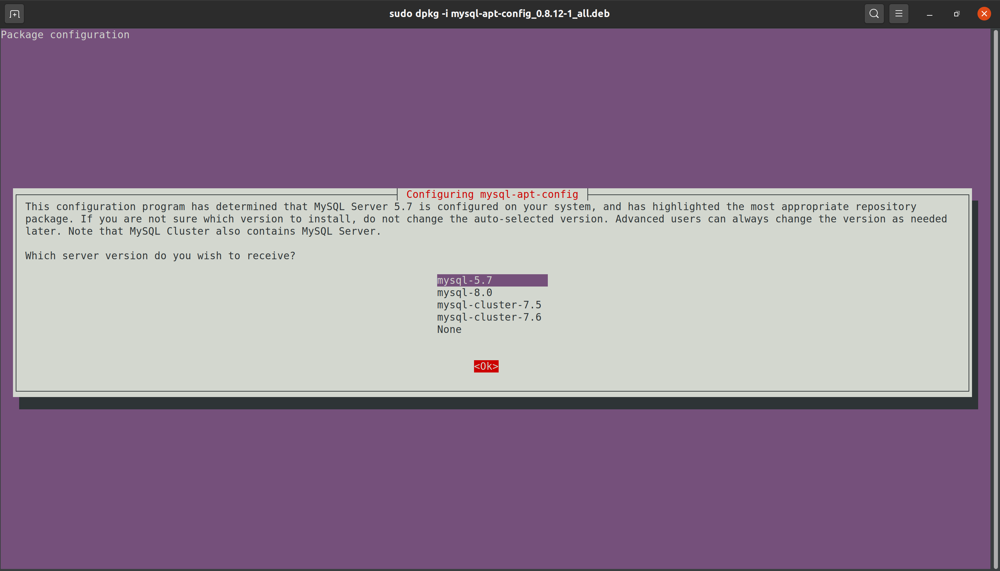
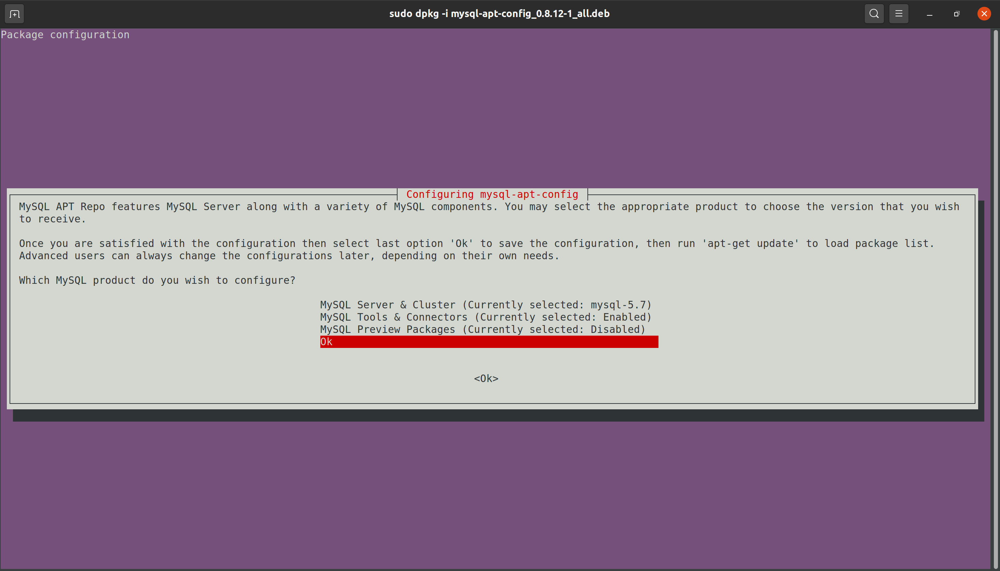

# All about installing Mysql 5.7 on Ubuntu

Install Mysql 5.7 on Mac is quite straight forward. However, setting on Ubuntu seems to be a bit challenging.

This repo contains the instruction to install Mysql 5.7 on Ubuntu 20.04 and also some configuration for how to tame the beast.

## Installaltion

### Download the official `mysql-apt-config` tool

```bash
wget https://dev.mysql.com/get/mysql-apt-config_0.8.12-1_all.deb
```

If this is failed, you can grab my back up at [`bin/mysql-apt-config_0.8.12-1_all.deb`](bin/mysql-apt-config_0.8.12-1_all.deb)

> **Note**: DO NOT use the latest verion because it doesn't give you the option to select the repo of Mysql 5.7. The latest one gives you only 1 choice: Mysql 8 or above.

Technically if you know exactly where is the PPA url, you can add it manually. Anyway, we are using an official convenient tool, so we are free from headache.

### Add the PPA by using the downloaded tool

```bash
sudo dpkg -i mysql-apt-config_0.8.12-1_all.deb
```

After executing this command, a `Text-based User Interface` (TUI) will be popout for you to do configuration.

Use `UP`/`DOWN` arrow keys to navigate. Select `Ubuntu Bionic` (aka Ubuntu 18.04). Press `Tab` key to move the cursor to `OK` button (while maintain selection at `Ubuntu Bionic`).



Next will be the main menu screen



Press `Enter` while the cursor is highlighting at line:

```bash
Mysql Server & Cluster (Currently selected: mysql-8.0)
```

This will lead to Mysql version selection menu



Select `Mysql 5.7` and confirm with `OK` button, you will be back to Main menu



Navigate to `OK` line, press `Enter`.

Finally, run these commands:

```bash
sudo apt update
sudo apt-cache policy mysql-server
```

You will see:

```bash
mysql-server:
  Installed: 5.7.32-1ubuntu18.04
  Candidate: 8.0.22-0ubuntu0.20.04.2
  Version table:
     8.0.22-0ubuntu0.20.04.2 500
        500 http://vn.archive.ubuntu.com/ubuntu focal-updates/main amd64 Packages
        500 http://vn.archive.ubuntu.com/ubuntu focal-updates/main i386 Packages
        500 http://security.ubuntu.com/ubuntu focal-security/main amd64 Packages
        500 http://security.ubuntu.com/ubuntu focal-security/main i386 Packages
     8.0.19-0ubuntu5 500
        500 http://vn.archive.ubuntu.com/ubuntu focal/main amd64 Packages
        500 http://vn.archive.ubuntu.com/ubuntu focal/main i386 Packages
 *** 5.7.32-1ubuntu18.04 500
        500 http://repo.mysql.com/apt/ubuntu bionic/mysql-5.7 amd64 Packages
        100 /var/lib/dpkg/status
```

Now you are able to extract the availble version of `Mysql 5.7`.
Please remember it for next step.

```bash
5.7.32-1ubuntu18.04
```

**Note**: before moving further, don't worry if you make mistake. You are always able to go back to this configuration with these commands:

```bash
# use these 2 lines if you mess up with distro detection and selection
sudo dpkg -r mysql-apt-config
sudo apt purge mysql-apt-config

# use these 2 lines to reconfig
sudo dpkg-reconfigure mysql-apt-config
sudo apt update
```

### Install Mysql 5.7 Community Version

Run this to install (with the version extracted above)

```bash
sudo apt install -f mysql-client=5.7.32-1ubuntu18.04 mysql-community-server=5.7.32-1ubuntu18.04 mysql-server=5.7.32-1ubuntu18.04
```

**DONE**! Mysql 5.7 Community Edition will be availble for use after this command finishes.

**Note**: In the midde of install process, you will be asked for setting up `password` of `root` user (for Mysql Server). This depends on your needs to input the password or leave it empty. If you are using for local development, you properly don't need the password for `root` user. So, leave the password empty and move to next step. Otherwises, Mysql is ready for use.

## Configurate Mysql with empty root password

Prior to the born of Docker, your app and your database has been living on the same machine, sharing the same ip address. So technically, you only need to allow empty password for

```bash
root@localhost # a.k.a root at localhost
```

Nowadays, within Docker, your database is living in the host machine while the app is running inside a container. This virtualization makes them 2 separated networks. So you gonna need a allow empty password for `everywhere`.

Here are steps:

Switch to Root user and access Mysql with this:

```bash
sudo su
mysql -uroot
```

After logged in into Mysql do like below.

```Sql
-- this one is for root@everywhere
update mysql.user set authentication_string=password(''), plugin='mysql_native_password' where user='root';
flush privileges;

-- this one is for root@localhost only
update mysql.user set authentication_string=password(''), plugin = 'mysql_native_password' where user='root' and host='localhost';
flush privileges;
```

If you want to ensure your root user is full power, then do this:

```Sql
grant all privileges on *.* to root@'%' identified by 'root';
flush privileges;
```

Verify if you need

```Sql
select Host, User, authentication_string from mysql.user where User="root";
```

Finally logout Mysql and logout Root user

```bash
exit # first exit to log out Mysql
exit # second exit to back your user account (remember the `sudo su`)
```

If your selection is `root@everywhere` then it's not done yet. Please continue to next section! (and hope it is the last one)

## Configurate Mysql to accept remote requeset

You had Mysql installed and runnable. Your Mysql has been configured to allow empty root password (convenient development). However, by default, your Mysql is not accept any login request except from `localhost` (a.k.a local request only).

Since you expect it accepts request from anywhere (like your another machine, your co-worker machine, or even your boss machine). Then it needs to be configured to accept remote request.

### The trap of Mysql document

Sometimes the official instruction is not working and ... Anyway, here is the case.

To get the list of possible location for Mysql configuration file you use this command:

```bash
$(which mysqld) --verbose --help | grep -A 1 "Default options"
```

Here is what you will get:

```bash
Default options are read from the following files in the given order:
/etc/my.cnf /etc/mysql/my.cnf ~/.my.cnf
```

Usually, you will expect to put configuration into this `~/.my.cnf`.
However, putting there doesn't work at all. Meanwhile the `/etc/my.cnf` hasn't existed yet.

Your only choice is putting into `/etc/mysql/my.cnf`.

However, open the `/etc/mysql/my.cnf`, it shows:

```conf
# bunch of comments
!includedir /etc/mysql/conf.d/
!includedir /etc/mysql/mysql.conf.d/
```

It turns out you should put your configuration into `/etc/mysql/mysql.conf.d/mysqld.conf`.
Open it and change the value of `bind-address`

```conf
# to this if you allow abitrary remote address/machine
bind-address = 0.0.0.0

# to this if you limit the address
bind-address = what-every-ip-you-expect
# Note that you can set only 1 ip.
# Multiple Ips feature is only availble from Mysql 8.0.13 :(
```

Finally, restart mysql to take the effect from change

```bash
sudo systemctl restart mysql
```

## Final thought

Things will get change. Content might be not correct. So feel free to correct.

Since I am not native English speaker, dictation is also a case. Expression is also a spot to improve.

Feel free to contribute to make it **correct** *AND* **human-readable**.
